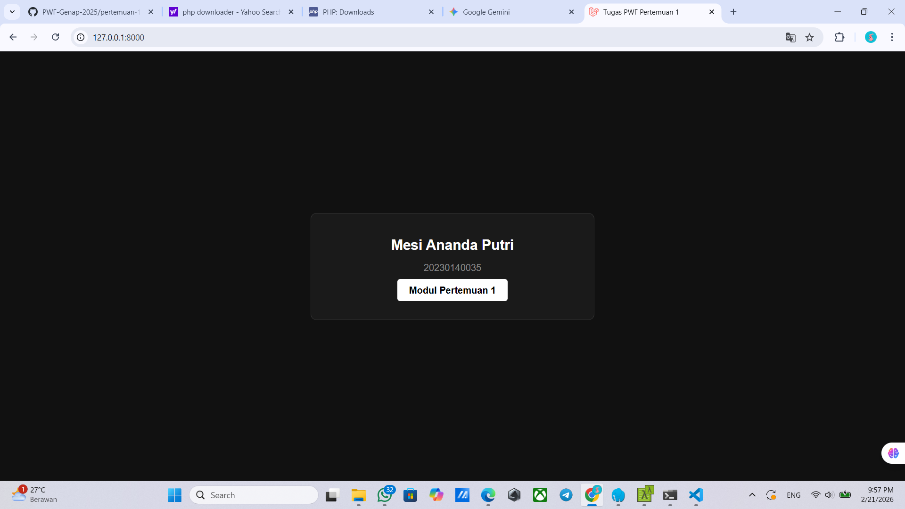

Hasil Tampilan

Tampilan About

Tampilan Register

Tampilan Login

Tampilan Login Sukses

PERTEMUAN 3

migrate

Database

PERTEMUAN 4

PERTEMUAN 5

Tampilan Admin1

Tampilan Admin2

Tampilan User

Tampilan Add Product

Tampilan Data User

Tampilan Data Product

PERTEMUAN 6

Validasi Field Kosong Pada Tambah Produk

Validasi Input Salah Pada Tambah Produk

Validasi Field Kosong Pada Edit Produk

Validasi Input Salah Pada Edit Produk

PRAKTIKUM 7

UCP 1
1. Tambah Kategori

2. Halaman Kategori

3. Edit Kategori

4. Hapus Kategori

